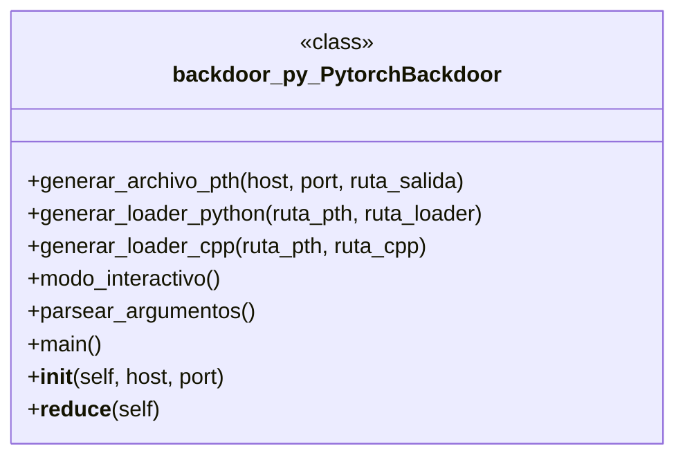

# Polyglot Codebase Knowledge Graph

> Generated offline by **readmenator**. 6 files, 12 symbols, 15 imports. Supports C, C++, Python, Go, Rust, JS/TS, Java, C#, Shell, PHP, Dart, GDScript, Nim, ASM, Ruby, Swift, Kotlin, Scala, Lua, Elixir.
> No LLMs. No tokens. Pure static analysis. See more [here](https://github.com/grisuno/ReadMenator)

**Start here:** Statistics Dashboard for scope, God Nodes for blast radius, Architecture Reference for per-file API. Agents: prefer `readmenator-agent/INDEX.md` + `SYMBOLS.md`.

**Wiki:** prefer `readmenator-wiki/index.md` for progressive disclosure: one synthesis page per community, `connections.json` with EXTRACTED vs INFERRED confidence, `queries.md` log, `REPORT.md` audit.

**Confidence:** EXTRACTED = parsed from source, INFERRED = heuristic bridge, AMBIGUOUS = reported, never hidden. See `readmenator-wiki/REPORT.md`.

**Total Files Parsed:** 6 | **Total Symbols Extracted:** 12 | **Total Imports:** 15

<!-- ranking_model: v1.0 | weights: {ppr:0.45,auth:0.2,test:0.15,doc:0.1,fresh:0.1} | alpha:0.85 | commit:05a4468 | date:2026-07-18 -->


## Table of Contents

1. [Statistics Dashboard](#statistics-dashboard)
2. [Architectural Layers](#architectural-layers)
3. [Ranked Context](#ranked-context)
4. [God Nodes](#god-nodes)
5. [Suggested Questions](#suggested-questions)
6. [Hotspot Analysis](#hotspot-analysis)
7. [Change Impact Analysis](#change-impact-analysis)
8. [Suggested Linting Rules](#suggested-linting-rules)
9. [Dataflow Analysis](#dataflow-analysis)
10. [Orphans](#orphans)
11. [Query Recipes](#query-recipes)
12. [Structural Knowledge Map](#structural-knowledge-map)
13. [UML Class Diagram](#uml-class-diagram)
14. [Code Property Graph](#code-property-graph)
15. [Architecture Reference](#architecture-reference)
    - [CPP (1 files)](#cpp-1-files)
    - [PY (3 files)](#py-3-files)
    - [SH (2 files)](#sh-2-files)

---

## Statistics Dashboard

| Metric | Value |
|--------|-------|
| Total Files | 6 |
| Total Symbols | 12 |
| Total Imports | 15 |
| Call Edges | 61 |
| Inheritance Edges | 0 |
| Languages | 3 |
| Avg Symbols/File | 2.0 |
| Avg Imports/File | 2.5 |

### Top Files by Import Count (Fan-Out)

| File | Imports | Symbols | Language |
|------|---------|---------|----------|
| `backdoor.py` | 6 | 9 | py |
| `loader.cpp` | 6 | 2 | cpp |
| `loader.py` | 3 | 1 | py |

---

## Architectural Layers

Auto-detected from path patterns, naming conventions, and imported frameworks.

| Layer | Files |
|-------|-------|
| utility | 6 |

### utility

- `app.py` (py, 0 symbols)
- `backdoor.py` (py, 9 symbols)
- `install.sh` (sh, 0 symbols)
- `loader.cpp` (cpp, 2 symbols)
- `loader.py` (py, 1 symbols)
- `pysintaller.sh` (sh, 0 symbols)

---

## Ranked Context

Files ranked by composite score for the current query context. The ranking combines Personalized PageRank (query relevance), global authority, test coverage, documentation coverage, and code freshness. Model: v1.0.

| Rank | File | Composite | PPR | Authority | Test | Doc |
|------|------|-----------|-----|-----------|------|-----|
| 1 | `app.py` | 0.1000 | 0.0000 | 0.0000 | 0.00 | 1.00 |
| 2 | `loader.py` | 0.1000 | 0.0000 | 0.0000 | 0.00 | 1.00 |
| 3 | `backdoor.py` | 0.0889 | 0.0000 | 0.0000 | 0.00 | 0.89 |
| 4 | `loader.cpp` | 0.0500 | 0.0000 | 0.0000 | 0.00 | 0.50 |
| 5 | `install.sh` | 0.0000 | 0.0000 | 0.0000 | 0.00 | 0.00 |
| 6 | `pysintaller.sh` | 0.0000 | 0.0000 | 0.0000 | 0.00 | 0.00 |

---

## God Nodes

Most architecturally central files ranked by combined import/export degree and symbol richness.

| File | Score | Connections | PageRank |
|------|-------|-------------|----------|
| `backdoor.py` | 0.9 | | 0.0000 |
| `loader.cpp` | 0.2 | | 0.0000 |
| `loader.py` | 0.1 | | 0.0000 |
| `app.py` | 0.0 | | 0.0000 |
| `install.sh` | 0.0 | | 0.0000 |
| `pysintaller.sh` | 0.0 | | 0.0000 |

---

## Suggested Questions

Auto-generated exploration prompts based on graph structure:

- What does backdoor.py depend on, and what depends on it? (0 connections)
- What does loader.cpp depend on, and what depends on it? (0 connections)
- What does loader.py depend on, and what depends on it? (0 connections)
- What is PytorchBackdoor in backdoor.py and how is it used?
- What is the overall architecture of this codebase?

---

## Hotspot Analysis

Files ranked by combined complexity (symbol count) and centrality (connection count). High-scoring files are architecturally critical and may need refactoring attention.

| File | Complexity | Centrality | Combined | Symbols | Connections |
|------|-----------|------------|----------|---------|-------------|
| `app.py` | 0.000 | 0.000 | 0.000 | 0 | 0 |
| `loader.py` | 0.111 | 0.500 | 0.344 | 1 | 3 |
| `backdoor.py` | 1.000 | 1.000 | 1.000 | 9 | 6 |
| `loader.cpp` | 0.222 | 1.000 | 0.689 | 2 | 6 |
| `install.sh` | 0.000 | 0.000 | 0.000 | 0 | 0 |
| `pysintaller.sh` | 0.000 | 0.000 | 0.000 | 0 | 0 |

---

## Dataflow Analysis

Procedural intra-function dataflow findings (zero tokens, regex-based heuristics, all INFERRED). Each lead is grounded at file:line for manual review.

**2 findings** (DEAD_STORE: 1, UNCHECKED_ALLOC: 1).

| File | Function | Line | Kind | Variable | Description |
|------|----------|------|------|----------|-------------|
| `backdoor.py` | `__init__` | 28 | `UNCHECKED_ALLOC` | `s` | Result of allocator stored in `s` is never checked against NULL. |
| `loader.cpp` | `main` | 19 | `DEAD_STORE` | `size` | `size` assigned at line 19 but never read afterwards. |

---

## Change Impact Analysis

Files sorted by how many other files would be affected if they changed. High-impact files should be changed with caution.

| File | Direct Dependents | Transitive Dependents | Total Impact |
|------|------------------|----------------------|--------------|
| `app.py` | 0 | 0 | 0 |
| `backdoor.py` | 0 | 0 | 0 |
| `install.sh` | 0 | 0 | 0 |
| `loader.cpp` | 0 | 0 | 0 |
| `loader.py` | 0 | 0 | 0 |
| `pysintaller.sh` | 0 | 0 | 0 |

---

## Suggested Linting Rules

Automatically suggested linting and security rules based on patterns detected in the codebase. These can be exported as Semgrep rules using the `--export-rules` flag.

| Rule ID | Severity | Description | Language | Matches |
|---------|----------|-------------|----------|---------|
| `RM001` | info | Large number of functions in py: 9 total | py | 9 |
| `RM002` | info | Print statement found (consider logging instead) | python | 33 |

---

## Orphans

Files with no documentation or low connectivity. These are candidates for documentation investment or cleanup.

- `install.sh` (0 symbols, no doc)
- `pysintaller.sh` (0 symbols, no doc)

---

## Query Recipes

Example queries you can run against this knowledge base using the ranking engine:

```
# Find files most relevant to a concept
readmenator query "Where is the import resolver implemented?"

# Rank files by relevance to a topic
readmenator query "How does documentation generation work?"

# Explain why a file ranks highly
readmenator query "explain readmenator/_documentation.py"

# Trace dependency paths with ranked context
readmenator query "path from CLI to exporter"
```

The ranking model uses the following signals:

- **Personalized PageRank** (45% weight): query-specific relevance via seed propagation
- **Global Authority** (20% weight): structural importance via standard PageRank
- **Test Coverage** (15% weight): fraction of symbols referenced in test files
- **Doc Coverage** (10% weight): presence of docstrings and file-level docs
- **Freshness** (10% weight): recent modification activity

Results include score decomposition and justification paths for each ranked item.

---

## Structural Knowledge Map

```mermaid
graph TD
    classDef mod fill:#1e1e1e,stroke:#ff6666,stroke-width:2px,color:#fff;
    classDef cls fill:#2d2d2d,stroke:#4ec9b0,stroke-width:2px,color:#fff;
    classDef fn fill:#333,stroke:#dcdcaa,stroke-width:1px,color:#dcdcaa;
    classDef ext fill:#111,stroke:#666,stroke-dasharray:5 5,color:#aaa;
    backdoor_py["backdoor.py (py)"]
    class backdoor_py mod;
    backdoor_py_PytorchBackdoor["PytorchBackdoor"]
    class backdoor_py_PytorchBackdoor cls;
    backdoor_py --> backdoor_py_PytorchBackdoor
    backdoor_py_generar_archivo_pth["generar_archivo_pth"]
    class backdoor_py_generar_archivo_pth fn;
    backdoor_py --> backdoor_py_generar_archivo_pth
    backdoor_py_generar_loader_python["generar_loader_python"]
    class backdoor_py_generar_loader_python fn;
    backdoor_py --> backdoor_py_generar_loader_python
    backdoor_py_generar_loader_cpp["generar_loader_cpp"]
    class backdoor_py_generar_loader_cpp fn;
    backdoor_py --> backdoor_py_generar_loader_cpp
    backdoor_py_modo_interactivo["modo_interactivo"]
    class backdoor_py_modo_interactivo fn;
    backdoor_py --> backdoor_py_modo_interactivo
    loader_cpp["loader.cpp (cpp)"]
    class loader_cpp mod;
    loader_py["loader.py (py)"]
    class loader_py mod;
    app_py["app.py (py)"]
    class app_py mod;
    install_sh["install.sh (sh)"]
    class install_sh mod;
    pysintaller_sh["pysintaller.sh (sh)"]
    class pysintaller_sh mod;
    ext_argparse["argparse"]
    class ext_argparse ext;
    backdoor_py -.->|imports| ext_argparse
    ext_pickle["pickle"]
    class ext_pickle ext;
    backdoor_py -.->|imports| ext_pickle
    ext_torch["torch"]
    class ext_torch ext;
    backdoor_py -.->|imports| ext_torch
    ext_os["os"]
    class ext_os ext;
    backdoor_py -.->|imports| ext_os
    ext_base64["base64"]
    class ext_base64 ext;
    backdoor_py -.->|imports| ext_base64
    ext_sys["sys"]
    class ext_sys ext;
    backdoor_py -.->|imports| ext_sys
    ext_torch_torch_h["torch.h"]
    class ext_torch_torch_h ext;
    loader_cpp -.->|imports| ext_torch_torch_h
    ext_c10_core_TensorTypeId_h["TensorTypeId.h"]
    class ext_c10_core_TensorTypeId_h ext;
    loader_cpp -.->|imports| ext_c10_core_TensorTypeId_h
    ext_iostream["iostream"]
    class ext_iostream ext;
    loader_cpp -.->|imports| ext_iostream
    ext_fstream["fstream"]
    class ext_fstream ext;
    loader_cpp -.->|imports| ext_fstream
    ext_chrono["chrono"]
    class ext_chrono ext;
    loader_cpp -.->|imports| ext_chrono
    ext_thread["thread"]
    class ext_thread ext;
    loader_cpp -.->|imports| ext_thread
    loader_py -.->|imports| ext_torch
    loader_py -.->|imports| ext_sys
    ext_time["time"]
    class ext_time ext;
    loader_py -.->|imports| ext_time
```



---

## UML Class Diagram

Auto-generated Mermaid class diagram from parsed class-level symbols. Shows classes, structs, interfaces, traits, and their methods with inheritance and dependency relationships.



---

## Code Property Graph

Machine-readable Code Property Graph (CPG) in JSON-LD format. This block allows AI agents to parse the full structural graph without additional file reads. Compatible with GraphRAG pipelines.

```json
{"@context": "https://schema.org", "analysis": {"communities": [], "god_nodes": [{"node_id": "backdoor.py", "score": 0.9}, {"node_id": "loader.cpp", "score": 0.2}, {"node_id": "loader.py", "score": 0.1}, {"node_id": "app.py", "score": 0.0}, {"node_id": "install.sh", "score": 0.0}, {"node_id": "pysintaller.sh", "score": 0.0}], "surprising_connections": []}, "edges": [{"confidence": "EXTRACTED", "relation": "imports", "source": "backdoor.py", "target": "argparse"}, {"confidence": "EXTRACTED", "relation": "imports", "source": "backdoor.py", "target": "pickle"}, {"confidence": "EXTRACTED", "relation": "imports", "source": "backdoor.py", "target": "torch"}, {"confidence": "EXTRACTED", "relation": "imports", "source": "backdoor.py", "target": "os"}, {"confidence": "EXTRACTED", "relation": "imports", "source": "backdoor.py", "target": "base64"}, {"confidence": "EXTRACTED", "relation": "imports", "source": "backdoor.py", "target": "sys"}, {"confidence": "EXTRACTED", "relation": "imports", "source": "loader.cpp", "target": "torch/torch.h"}, {"confidence": "EXTRACTED", "relation": "imports", "source": "loader.cpp", "target": "c10/core/TensorTypeId.h"}, {"confidence": "EXTRACTED", "relation": "imports", "source": "loader.cpp", "target": "iostream"}, {"confidence": "EXTRACTED", "relation": "imports", "source": "loader.cpp", "target": "fstream"}, {"confidence": "EXTRACTED", "relation": "imports", "source": "loader.cpp", "target": "chrono"}, {"confidence": "EXTRACTED", "relation": "imports", "source": "loader.cpp", "target": "thread"}, {"confidence": "EXTRACTED", "relation": "imports", "source": "loader.py", "target": "torch"}, {"confidence": "EXTRACTED", "relation": "imports", "source": "loader.py", "target": "sys"}, {"confidence": "EXTRACTED", "relation": "imports", "source": "loader.py", "target": "time"}], "generator": "readmenator", "metadata": {"edge_count": 76, "file_count": 6, "language_count": 3, "symbol_count": 12}, "nodes": [{"doc": "app.py  Autor: Gris Iscomeback Correo electrónico: grisiscomeback[at]gmail[dot]com Fecha de creación: xx/xx/xxxx Licencia: GPL v3  Descripción:", "id": "app.py", "kind": "module", "label": "app.py", "language": "py", "sha256": "57b21bdb023585b8", "symbol_count": 0, "symbols": []}, {"doc": "pth_builder.py - PoC generador de backdoor en archivos .pth (PyTorch) Uso interactivo: python3 pth_builder.py Uso por flags: python3 pth_builder.py -H 10.0.0.5 -P 8080 -o modelo.pth", "id": "backdoor.py", "kind": "module", "label": "backdoor.py", "language": "py", "sha256": "7c7b2909cc2dfae5", "symbol_count": 9, "symbols": [{"doc": "Esta clase se serializa en el archivo .pth.\nAl deserializar (torch.load con weights_only=False), pickle ejecuta\nel código devuelto por __reduce__.", "kind": "class", "line": 17, "name": "PytorchBackdoor", "signature": "class PytorchBackdoor"}, {"doc": "Crea el objeto backdoor y lo guarda mediante torch.save.", "kind": "method", "line": 51, "name": "generar_archivo_pth", "signature": "def generar_archivo_pth(host, port, ruta_salida)"}, {"doc": "Genera un script Python que carga el .pth en memoria.\nEs crítico establecer weights_only=False para que el payload se ejecute.", "kind": "method", "line": 59, "name": "generar_loader_python", "signature": "def generar_loader_python(ruta_pth, ruta_loader)"}, {"doc": "Versión conceptual en C++ utilizando libtorch.\nLa API de C++ (torch::load) también es vulnerable si no se restringen\nlas clases permitidas. En versiones recientes, se puede pasar un\nfiltro personalizado, pero por defecto en modo release suele estar\ndesactivado para velocidad.", "kind": "method", "line": 97, "name": "generar_loader_cpp", "signature": "def generar_loader_cpp(ruta_pth, ruta_cpp)"}, {"doc": "Solicita los parámetros al usuario en la consola.", "kind": "method", "line": 134, "name": "modo_interactivo", "signature": "def modo_interactivo()"}, {"doc": "Configura argparse.\nNota: Se usa '-H' para hostname (ya que '-h' está reservado por defecto\npara help, aunque se podría sobrecargar). Para cumplir con la solicitud\ndel usuario de '--hostname' o '-h', se añade '-n' como short para hostname\ny se deja '-h' para help, pero se menciona explícitamente en la ayuda.", "kind": "method", "line": 156, "name": "parsear_argumentos", "signature": "def parsear_argumentos()"}, {"kind": "method", "line": 184, "name": "main", "signature": "def main()"}, {"kind": "method", "line": 23, "name": "__init__", "signature": "def __init__(self, host, port)"}, {"doc": "El método __reduce__ debe retornar una tupla (callable, args).\nAquí retornamos (exec, (codigo_base64_decodificado,)).\n'exec' es una función built-in que ejecuta código Python.", "kind": "method", "line": 38, "name": "__reduce__", "signature": "def __reduce__(self)"}]}, {"id": "install.sh", "kind": "module", "label": "install.sh", "language": "sh", "sha256": "c907d80fd6734993", "symbol_count": 0, "symbols": []}, {"doc": "loader_fixed.cpp - Carga .pth usando torch::pickle_load para evitar jit::load", "id": "loader.cpp", "kind": "module", "label": "loader.cpp", "language": "cpp", "sha256": "3a102d23bb37dd29", "symbol_count": 2, "symbols": [{"kind": "function", "line": 9, "name": "main", "signature": "int main()"}, {"kind": "function", "line": 21, "name": "buffer", "signature": "std::vector<char> buffer(size);"}]}, {"doc": "loader.py - Carga el archivo .pth y ejecuta el backdoor (PoC) ADVERTENCIA: Este script es solo para entornos de prueba controlados.", "id": "loader.py", "kind": "module", "label": "loader.py", "language": "py", "sha256": "d32cb9df3b8be3e7", "symbol_count": 1, "symbols": [{"kind": "function", "line": 8, "name": "main", "signature": "def main()"}]}, {"id": "pysintaller.sh", "kind": "module", "label": "pysintaller.sh", "language": "sh", "sha256": "3d06964500ea6b2c", "symbol_count": 0, "symbols": []}], "type": "CodePropertyGraph", "version": "1.0"}
```

---

## Architecture Reference

### CPP (1 files)

#### `loader.cpp`
**Path:** `loader.cpp`
**File Doc:** *loader_fixed.cpp - Carga .pth usando torch::pickle_load para evitar jit::load*

**Functions:**
- `main` (line 9) `int main()`
- `buffer` (line 21) `std::vector<char> buffer(size);`

### PY (3 files)

#### `app.py`
**Path:** `app.py`
**File Doc:** *app.py  Autor: Gris Iscomeback Correo electrónico: grisiscomeback[at]gmail[dot]com Fecha de creación: xx/xx/xxxx Licencia: GPL v3  Descripción:*

*No symbols extracted*

#### `backdoor.py`
**Path:** `backdoor.py`
**File Doc:** *pth_builder.py - PoC generador de backdoor en archivos .pth (PyTorch) Uso interactivo: python3 pth_builder.py Uso por flags: python3 pth_builder.py -H 10.0.0.5 -P 8080 -o modelo.pth*

**Classes:**
- `PytorchBackdoor` (line 17) `class PytorchBackdoor` - *Esta clase se serializa en el archivo .pth.
Al deserializar (torch.load con weights_only=False), pickle ejecuta
el código devuelto por __reduce__.*

**Methods:**
- `generar_archivo_pth` (line 51) `def generar_archivo_pth(host, port, ruta_salida)` - *Crea el objeto backdoor y lo guarda mediante torch.save.*
- `generar_loader_python` (line 59) `def generar_loader_python(ruta_pth, ruta_loader)` - *Genera un script Python que carga el .pth en memoria.
Es crítico establecer weights_only=False para que el payload se ejecute.*
- `generar_loader_cpp` (line 97) `def generar_loader_cpp(ruta_pth, ruta_cpp)` - *Versión conceptual en C++ utilizando libtorch.
La API de C++ (torch::load) también es vulnerable si no se restringen
las clases permitidas. En versiones recientes, se puede pasar un
filtro personalizado, pero por defecto en modo release suele estar
desactivado para velocidad.*
- `modo_interactivo` (line 134) `def modo_interactivo()` - *Solicita los parámetros al usuario en la consola.*
- `parsear_argumentos` (line 156) `def parsear_argumentos()` - *Configura argparse.
Nota: Se usa '-H' para hostname (ya que '-h' está reservado por defecto
para help, aunque se podría sobrecargar). Para cumplir con la solicitud
del usuario de '--hostname' o '-h', se añade '-n' como short para hostname
y se deja '-h' para help, pero se menciona explícitamente en la ayuda.*
- `main` (line 184) `def main()`
- `__init__` (line 23) `def __init__(self, host, port)`
- `__reduce__` (line 38) `def __reduce__(self)` - *El método __reduce__ debe retornar una tupla (callable, args).
Aquí retornamos (exec, (codigo_base64_decodificado,)).
'exec' es una función built-in que ejecuta código Python.*

#### `loader.py`
**Path:** `loader.py`
**File Doc:** *loader.py - Carga el archivo .pth y ejecuta el backdoor (PoC) ADVERTENCIA: Este script es solo para entornos de prueba controlados.*

**Functions:**
- `main` (line 8) `def main()`

### SH (2 files)

#### `install.sh`
**Path:** `install.sh`

*No symbols extracted*

#### `pysintaller.sh`
**Path:** `pysintaller.sh`

*No symbols extracted*
