# Polyglot Codebase Knowledge Graph

> Generated offline by **readmenator**. Supports C, C++, Python, Go, Rust, JS/TS, Java, C#, Shell, PHP, Dart, GDScript, Nim, ASM.
> No LLMs. No tokens. Pure static analysis.

**Total Files Parsed:** 6 | **Total Symbols Extracted:** 11 | **Total Imports:** 15

## Structural Knowledge Map

```mermaid
graph TD
    classDef mod fill:#1e1e1e,stroke:#ff6666,stroke-width:2px,color:#fff;
    classDef cls fill:#2d2d2d,stroke:#4ec9b0,stroke-width:2px,color:#fff;
    classDef fn fill:#333,stroke:#dcdcaa,stroke-width:1px,color:#dcdcaa;
    classDef ext fill:#111,stroke:#666,stroke-dasharray: 5 5,color:#aaa;
    backdoor_py["backdoor.py (py)"]
    class backdoor_py mod;
    backdoor_py_PytorchBackdoor["PytorchBackdoor"]
    class backdoor_py_PytorchBackdoor cls;
    backdoor_py --> backdoor_py_PytorchBackdoor
    backdoor_py_generar_archivo_pth["generar_archivo_pth"]
    class backdoor_py_generar_archivo_pth fn;
    backdoor_py --> backdoor_py_generar_archivo_pth
    backdoor_py_generar_loader_python["generar_loader_python"]
    class backdoor_py_generar_loader_python fn;
    backdoor_py --> backdoor_py_generar_loader_python
    backdoor_py_generar_loader_cpp["generar_loader_cpp"]
    class backdoor_py_generar_loader_cpp fn;
    backdoor_py --> backdoor_py_generar_loader_cpp
    backdoor_py_modo_interactivo["modo_interactivo"]
    class backdoor_py_modo_interactivo fn;
    backdoor_py --> backdoor_py_modo_interactivo
    loader_cpp["loader.cpp (cpp)"]
    class loader_cpp mod;
    loader_cpp_main["main"]
    class loader_cpp_main fn;
    loader_cpp --> loader_cpp_main
    loader_py["loader.py (py)"]
    class loader_py mod;
    loader_py_main["main"]
    class loader_py_main fn;
    loader_py --> loader_py_main
    app_py["app.py (py)"]
    class app_py mod;
    install_sh["install.sh (sh)"]
    class install_sh mod;
    pysintaller_sh["pysintaller.sh (sh)"]
    class pysintaller_sh mod;
    ext_argparse["argparse"]
    class ext_argparse ext;
    backdoor_py -.->|imports| ext_argparse
    ext_pickle["pickle"]
    class ext_pickle ext;
    backdoor_py -.->|imports| ext_pickle
    ext_torch["torch"]
    class ext_torch ext;
    backdoor_py -.->|imports| ext_torch
    ext_os["os"]
    class ext_os ext;
    backdoor_py -.->|imports| ext_os
    ext_base64["base64"]
    class ext_base64 ext;
    backdoor_py -.->|imports| ext_base64
    ext_sys["sys"]
    class ext_sys ext;
    backdoor_py -.->|imports| ext_sys
    ext_torch_torch_h["torch.h"]
    class ext_torch_torch_h ext;
    loader_cpp -.->|imports| ext_torch_torch_h
    ext_c10_core_TensorTypeId_h["TensorTypeId.h"]
    class ext_c10_core_TensorTypeId_h ext;
    loader_cpp -.->|imports| ext_c10_core_TensorTypeId_h
    ext_iostream["iostream"]
    class ext_iostream ext;
    loader_cpp -.->|imports| ext_iostream
    ext_fstream["fstream"]
    class ext_fstream ext;
    loader_cpp -.->|imports| ext_fstream
    ext_chrono["chrono"]
    class ext_chrono ext;
    loader_cpp -.->|imports| ext_chrono
    ext_thread["thread"]
    class ext_thread ext;
    loader_cpp -.->|imports| ext_thread
    loader_py -.->|imports| ext_torch
    loader_py -.->|imports| ext_sys
    ext_time["time"]
    class ext_time ext;
    loader_py -.->|imports| ext_time
```

---

## Architecture Reference

### CPP (1 files)

#### `loader.cpp`
**Path:** `loader.cpp`

**Functions:**
- `main` (line 8) - *loader_fixed.cpp - Carga .pth usando torch::pickle_load para evitar jit::load include <torch/torch.h> include <c10/core/TensorTypeId.h>  // Para de...*

### PY (3 files)

#### `app.py`
**Path:** `app.py`

*No symbols extracted*

#### `backdoor.py`
**Path:** `backdoor.py`

**Classs:**
- `PytorchBackdoor` (line 17) - *Esta clase se serializa en el archivo .pth.
Al deserializar (torch.load con weights_only=False), pickle ejecuta
el código devuelto por __reduce__.*

**Functions:**
- `generar_archivo_pth` (line 51) - *Crea el objeto backdoor y lo guarda mediante torch.save.*
- `generar_loader_python` (line 59) - *Genera un script Python que carga el .pth en memoria.
Es crítico establecer weights_only=False para que el payload se ejecute.*
- `generar_loader_cpp` (line 97) - *Versión conceptual en C++ utilizando libtorch.
La API de C++ (torch::load) también es vulnerable si no se restringen
las clases permitidas. En versiones recientes, se puede pasar un
filtro personalizado, pero por defecto en modo release suele estar
desactivado para velocidad.*
- `modo_interactivo` (line 134) - *Solicita los parámetros al usuario en la consola.*
- `parsear_argumentos` (line 156) - *Configura argparse.
Nota: Se usa '-H' para hostname (ya que '-h' está reservado por defecto
para help, aunque se podría sobrecargar). Para cumplir con la solicitud
del usuario de '--hostname' o '-h', se añade '-n' como short para hostname
y se deja '-h' para help, pero se menciona explícitamente en la ayuda.*
- `main` (line 184)
- `__init__` (line 23)
- `__reduce__` (line 38) - *El método __reduce__ debe retornar una tupla (callable, args).
Aquí retornamos (exec, (codigo_base64_decodificado,)).
'exec' es una función built-in que ejecuta código Python.*

#### `loader.py`
**Path:** `loader.py`

**Functions:**
- `main` (line 8)

### SH (2 files)

#### `install.sh`
**Path:** `install.sh`

*No symbols extracted*

#### `pysintaller.sh`
**Path:** `pysintaller.sh`

*No symbols extracted*
